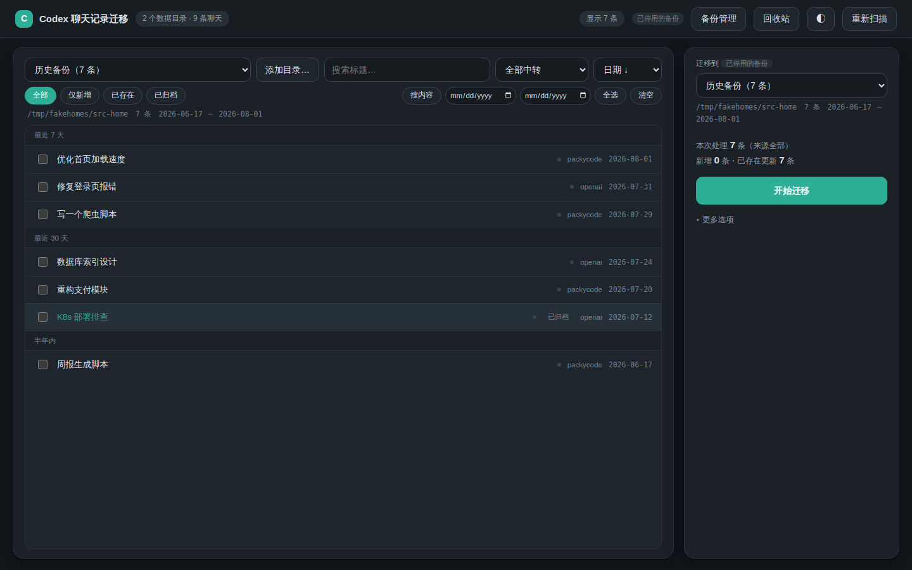
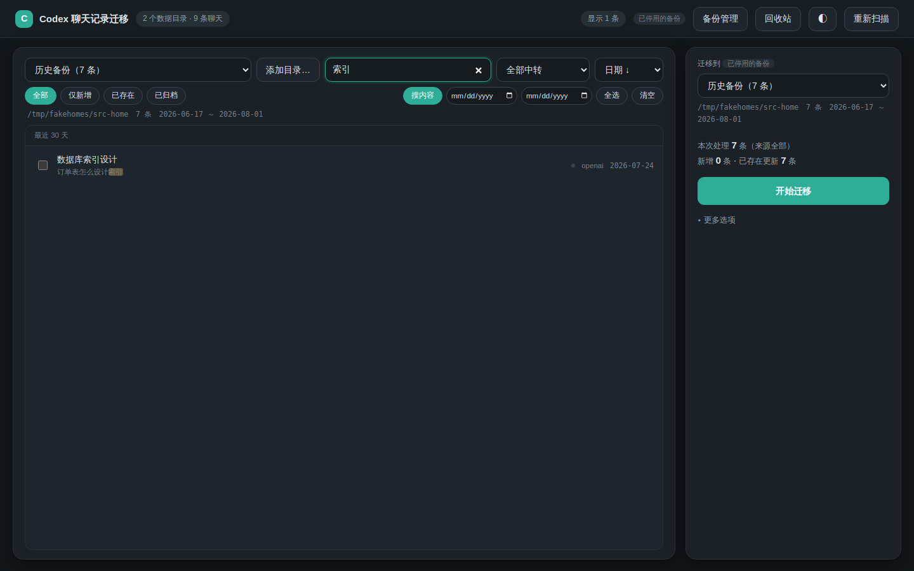
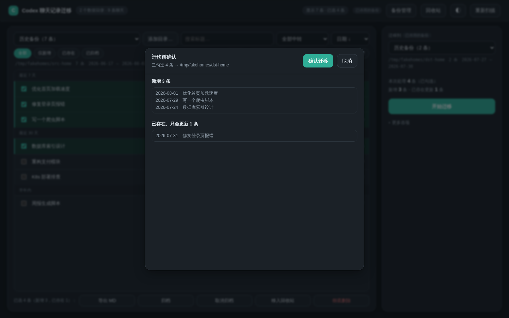
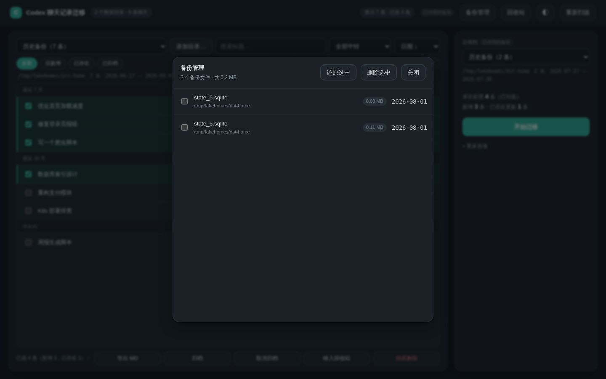

# Codex 合并台

一个轻量级本地桌面工具，用来扫描、查看、合并和导出 Codex 聊天记录。

## 界面与用法

### 主界面：浏览与迁移



1. 左上下拉框选择**来源目录**（自动扫描到的 Codex 数据目录），也可点「添加目录…」手动加入
2. 列表按日期分组展示所有会话，右上可切换排序（日期 ↓ / 日期 ↑ / 标题 / 中转）
3. 筛选行支持：仅新增 / 已存在 / 已归档、按中转筛选、日期范围过滤
4. 勾选要迁移的会话（点分组标题旁的「全选本组」可整组勾选，「全选」按钮可一键全选/取消全选）
5. 右侧选择**目标目录**，点「开始迁移」

### 搜索聊天内容



搜索框默认只搜标题；点亮「搜内容」后会同时搜索聊天正文，命中的会话下方显示高亮片段。

### 迁移前差异预览



点「开始迁移」后先弹出确认预览，列出将**新增**和**已存在、只会更新**的会话清单，确认无误再执行。所有写操作前会自动备份 `state_5.sqlite` 等文件。

### 备份管理



顶部「备份管理」可查看每次迁移自动生成的 `.merge-backup-*` 备份（大小、时间），支持一键还原或删除释放空间。

其他功能：勾选会话后可「导出 MD」（合并导出为 Markdown）；「回收站」可找回误删会话；右上角可切换深浅色主题（默认跟随系统）。

## 桌面版

双击 `Codex合并台桌面版.app` 即可打开 macOS 桌面窗口。桌面壳使用系统自带 WebKit，不依赖 Electron。

启动后会自动扫描当前 macOS 用户可访问的 Codex 记录，包括当前 `~/.codex`、`~/.codex-backups` 的所有备份层级，以及 `Project`、`Projects`、`Documents`、`Desktop`、`Downloads` 和 `Library/Application Support` 中的 Codex 数据目录。

扫描只识别 `state_5.sqlite`、`session_index.jsonl`、`sessions` 和 `archived_sessions`，不会读取 `auth.json`。缓存、依赖和系统构建目录会被跳过。当前环境会显示两个记录源：当前账户 177 个会话，历史账户 80 个会话。

启动时只读取会话索引，完整消息在点击聊天时按需加载，以避免一次性传输几十 MB 的历史数据。

生成 macOS `.app`：

```bash
./install_desktop_macos_app.sh
```

生成后双击 `Codex合并台桌面版.app` 即可使用。

## Windows 桌面版

需要先安装 Python 3（勾选 "Add to PATH"）。双击 `Codex合并台桌面版.bat` 即可打开桌面窗口：内嵌启动本地服务，并用 Edge/Chrome 的应用模式窗口展示（无浏览器地址栏）；找不到 Edge/Chrome 时退回默认浏览器。

生成独立 exe 或桌面快捷方式（右键 → 使用 PowerShell 运行）：

```powershell
powershell -ExecutionPolicy Bypass -File install_desktop_windows_app.ps1
```

- 已安装 PyInstaller（`pip install pyinstaller`）时会生成 `Codex合并台桌面版.exe`，可独立分发、无需 Python。
- 未安装 PyInstaller 时会创建带图标（`AppIcon.ico`）的桌面快捷方式。

Windows 上的 Web 版：双击 `Codex合并台.bat`，浏览器会自动打开 `http://127.0.0.1:4174`。

## Web 版

1. 双击 `Codex合并台.command`
2. 浏览器会自动打开 `http://127.0.0.1:4174`
3. 页面会自动扫描当前机器的 Codex 记录
4. 也可以点击“导入”，或者把 JSON / JSONL 文件拖进页面
5. 也可以点“文件夹”，一次导入一个目录里的多份记录
6. 在左侧切换账户和聊天
7. 导入两个或以上账户后，点击“合并”
8. 选中合并后的账户后再点击“导出”

直接用 `file://` 打开页面时，浏览器不能读取 `~/.codex`，只能手动导入文件。

## 命令行

```bash
python3 server.py --open
```

扫描多个 Codex 目录：

```bash
python3 server.py --open --codex-homes "/path/to/old/.codex,~/.codex"
```

只检查扫描结果：

```bash
python3 server.py --scan-json
```

## 合并规则

- 同一个聊天键优先保留最新时间戳
- 如果时间戳相同，再比较消息条数
- 合并后的账户会标记为 `merged`
- 文件夹导入时，会优先按目录名推断账户名
- 同名账户会自动聚合到一起
- 解析不出结构时，会退回到原始文本预览，避免整份文件消失

## 项目结构

| 文件 | 职责 |
| --- | --- |
| `server.py` | 本地 HTTP 服务：扫描 Codex 目录、会话/搜索/回收站 API、合并/删除/重命名等写操作（写前自动备份） |
| `index.html` / `app.js` / `styles.css` | 前端三列界面与全部交互逻辑 |
| `macos_app.swift` | macOS 桌面壳（WKWebView + 原生弹窗/文件面板） |
| `install_desktop_macos_app.sh` | 编译 Swift 壳并打包 `.app` |
| `windows_app.py` / `install_desktop_windows_app.ps1` | Windows 桌面版及打包脚本 |
| `Codex合并台.command` / `Codex合并台.bat` | Web 版启动脚本（浏览器访问本地服务） |

## 本地保存

手动导入的小型数据会尝试保存在浏览器 `localStorage`。完整 Codex 历史超过缓存容量时不会强行写入，而是在下次打开时重新扫描本机源文件。

导出原始记录源时，后台会读取该来源的完整会话内容后再生成 JSON，不会只导出已经点开过的聊天。
